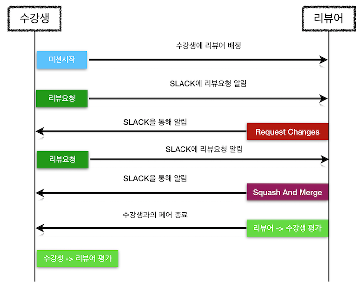

# NEXTSTEP 리뷰 진행 과정 및 리뷰어 가이드

---
**NEXTSTEP의 리뷰 진행 과정 및 리뷰어 가이드 전체 과정을 볼 수 있기 때문에 다음 동영상을 먼저 볼 것을 추천**
[](https://vimeo.com/414995264/7299672b47)

---
#### 리뷰 진행 프로세스


---
#### 피드백 시간 및 백업
- 리뷰 요청 후 24시간 이내에 피드백하는 것을 원칙으로 한다.
- 24시간 이내에 리뷰 요청이 힘든 상황이 발생하면 강사에게 도움을 요청한다.
- 동기 부여 측면에서 가장 좋은 시점은 수강생이 퇴근 후 미션을 진행할 수 있도록 하는 것이다.
  - 예를 들어 주중은 리뷰 요청한 다음 날 19시까지 피드백을 한다.

---
## 리뷰어 가이드(넥스트스텝)
- 친절한 답변보다 질문을 하는 것이 리뷰이에게 더 도움이 될 수 있다. 리뷰이의 성장을 위한 질문을 하라
- 한번에 나쁜 습관을 모두 바꾸려는 욕심을 버려라.
- 너무 꼼꼼한 리뷰를 하느라 늦게 피드백하는 것보다 부족함이 있어도 빠른 피드백이 더 의미있을 수 있다.
- 각 단계별 Request Changes는 2회 이내로 한다.
- 반영할 피드백 내용이 큰 변화가 아니라면 merge 후 다음 단계에서 반영하도록 유도한다.
- 부족한 점이 있더라도 merge함으로써 다음 단계에 도전하도록 유도한다.
- 나쁜 습관을 바꾸는 것보다 포기하지 않도록 동기부여하는 것이 더 중요하다.
- 너무 친절한 리뷰어가 있다면 슬랙의 리뷰어 파출소에 신고한다.

---
## 리뷰어 가이드(해외 서비스 자료)
- 코드는 단순하게(Simplify code)
- 떠먹여주지 않는 친절함을 연습하라(Practice kindness)
- 이유와 함께 예시로 설명하라(Explain why&with examples)
- 학습자와의 연결(Connect Learners)
- 코드방식을 통일하라 (Style Consistantly)
- 리뷰를 위한 리뷰를 억지로 하지마라. 대신 피드백할 게 없으면 칭찬하라.
- 구현을 잘한 부분에 대해 칭찬의 메시지를 남겨라.
- 내가 결정하지 말고 상대방이 선택하도록 하라.

---
## 리뷰어 선언문
> 이 선언문은 리뷰어가 현장의 개발 업무와 리뷰를 병행할 수 있도록 리뷰의 부담을 줄이기 위함이다.

- 하나! 가급적 질문만 하겠다. 
- 둘! 열심히 하는 것 같은 리뷰어를 감시하고 고발하겠다
- 셋! 잘하려는 사람에게 비난을 하겠다.
- 넷! 보이면 내가 먼저 선빵을 날리겠다.
- 다섯! 한 pr의 코드 리뷰에 30분의 시간을 넘게 쓴 것 같으면 신고한다.
- 여섯! 함께 자라기에 이어 함께 버리기
- 일곱! 너무 과하게 친절한 리뷰어를 감시하고, 역질문 스킬을 공유한다.

---
## 리뷰어 파출소(슬랙 채널)에 신고할 목록
- 3회 이상 핑퐁 멈춰! ✋🏻
- 코드를 제외하고 5줄 이상의 친절한 답변 스톱! 🚫 
- 스텝1에서 코멘트가 20개 이상 멈춰! 🕺🏻 
- 질문채널로 질문을 안보내면 어쩔티비! 📺 
- 지나치게 열린 질문 또는 답을 요구하는데 역질문 안한다고!

---
## 리뷰 팁

---
#### IntelliJ에서 PR에다 바로 코드리뷰하기
- GitHub의 PR에서 리뷰할 수도 있지만 IntelliJ에서 PR에다 바로 코드리뷰하는 것이 가능함
- IntelliJ에서 미션 코드도 실행해 보고 코드 리뷰도 가능함
- [IntelliJ에서 PR에다 코드리뷰하기 문서 참고](https://blog.jetbrains.com/idea/2020/05/intellij-idea-2020-2-early-access-program-is-starting)

---
#### 반복적인 피드백 정리하기
- 코드 리뷰를 하다보면 반복적인 코드 리뷰가 발생한다. 
- 매번 같은 메시지를 반복적으로 타이핑하기보다 한번 작성한 후에 copy & paste로 해결한다.

**예시**
```
우승자를 구하는 로직도 복잡한데 이에 대한 테스트 코드 구현을 도전해 보면 어떨까?
자동차 race가 모두 끝난 상태의 자동차 목록을 객체의 인자로 전달해 테스트 가능하도록 설계해 본다.
즉, List<Car>를 객체의 생성자로 전달하고 전달한 Car 데이터에 따라 우승자를 구하는 방식으로 새로운 객체를 추가해 본다.
Car의 경우 생성자에 `Car(String name, int position)`을 가지는 생성자가 있다면 테스트할 때 임의로 위치 값을 지정할 수 있지 않을까?
```

---
## FAQ

---
#### NEXTSTEP의 리뷰 목표가 요청 후 24시간 이내인데요. 24시간 이내에 리뷰할 수 없는 상황이면 어떻게 하나요?
먼저 수강생에게 양해를 구할 것을 추천합니다.
개인적인 사정 때문에 24시간 내에 리뷰하기 힘들고, 언제 가능한지를 공유하는 것이 좋아요.
만약 개인적인 사정 때문에 48시간 내에 리뷰하기 힘든 상황이 발생하면 교육 설계자(박재성)에게 도움을 요청하세요.

---
#### 수강생들의 미션 진행은 하나의 미션이 종료되어야만 다음 미션을 진행 가능한가요?
아닙니다.
동시에 2개 이상의 미션을 진행할 수 있습니다.
리뷰어 피드백이 늦을 수도 있기 때문에 2개 정도의 미션을 동시에 진행하는 것을 추천하고 있어요.

---
#### 리뷰어 한명당 담당하게 되는 수강생은 미션당 몇 명이 되나요?
리뷰어들이 회사일과 병행하기 때문에 현재는 5명을 기본으로 하고 있어요.
단, 리뷰어들의 요청에 따라 리뷰이의 수는 5명에서 가감될 수 있습니다.

---
## 🔗 참고 링크
- [NEXTSTEP 리뷰어 분의 리뷰어 활동 후기- 회사 눈치 안 보고 투잡하기](https://woowabros.github.io/woowabros/2019/08/22/code-reviewer.html)
- [카카오 신입사원 교육 리뷰어 분의 활동 후기 - 뉴크루 온보딩 코드 리뷰어로 참여하기](https://tech.kakao.com/2021/04/08/welcome-new-krew3)
