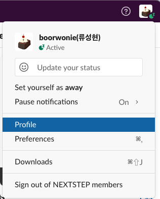
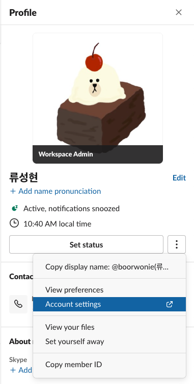
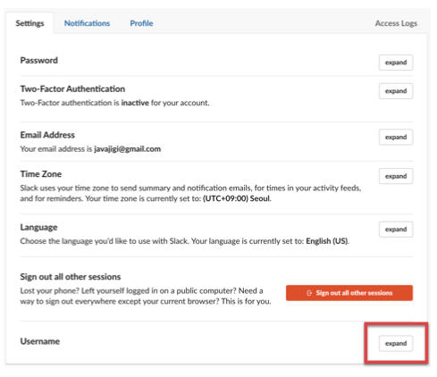
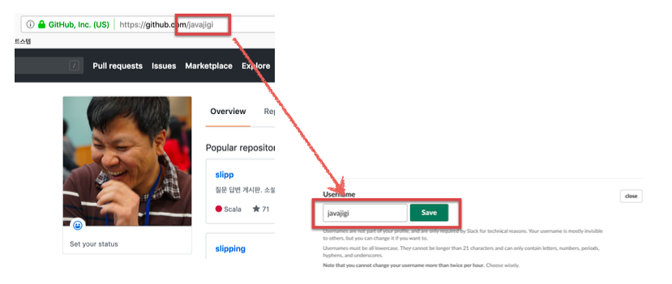
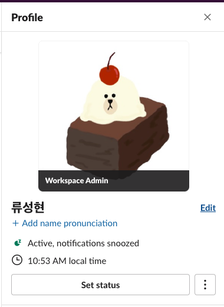
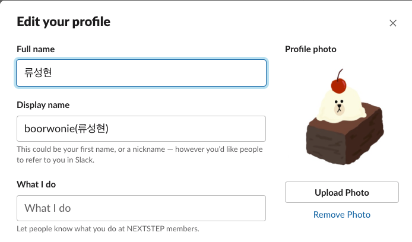

# Slack username 설정
1. 넥스트스텝 멤버스 slack 에 로그인한다.
2. 우측 상단의 자신의 아이디를 클릭한다.
3. Profile 메뉴를 클릭한다.

4. 우측 화면에서 Set status 우측의 ... 을 클릭한다. 
5. Account settings 메뉴를 클릭한다.

6. Settings 탭의 Username의 expand 버튼을 클릭한다.

7. Slack Username을 GitHub ID로 변경하고 저장한다.
   단, GitHub ID에 대문자가 포함되어 있으면 소문자로 변경한다.(예. JavaJiGi -> javajigi)

# Slack display name 설정

1. 넥스트스텝 멤버스 slack 에 로그인한다.
2. 우측 상단의 자신의 아이디를 클릭한다.
3. Profile 메뉴를 클릭한다.

4. 우측 화면에서 이름 우측의 Edit을 클릭한다.

5. Display name 항목을 “github id(이름)” 형식으로 작성한다.

